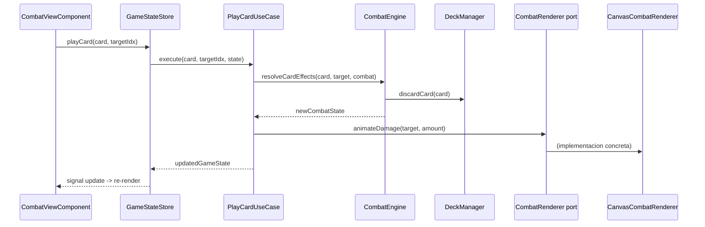
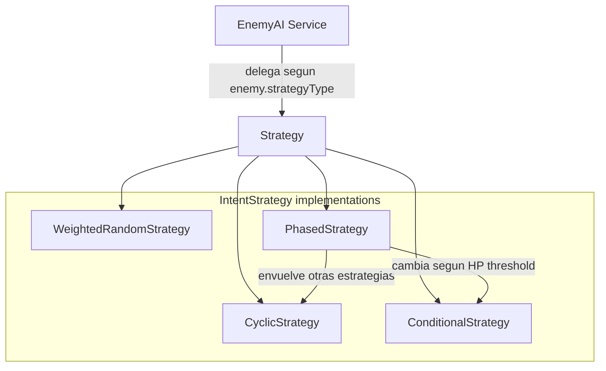
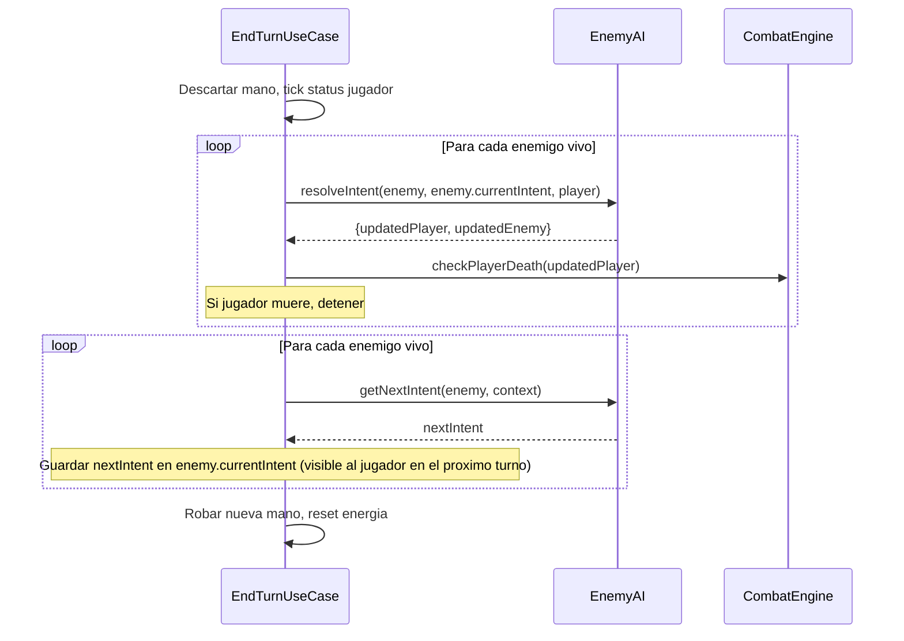
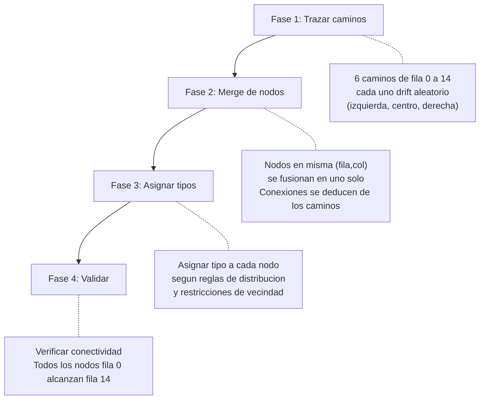
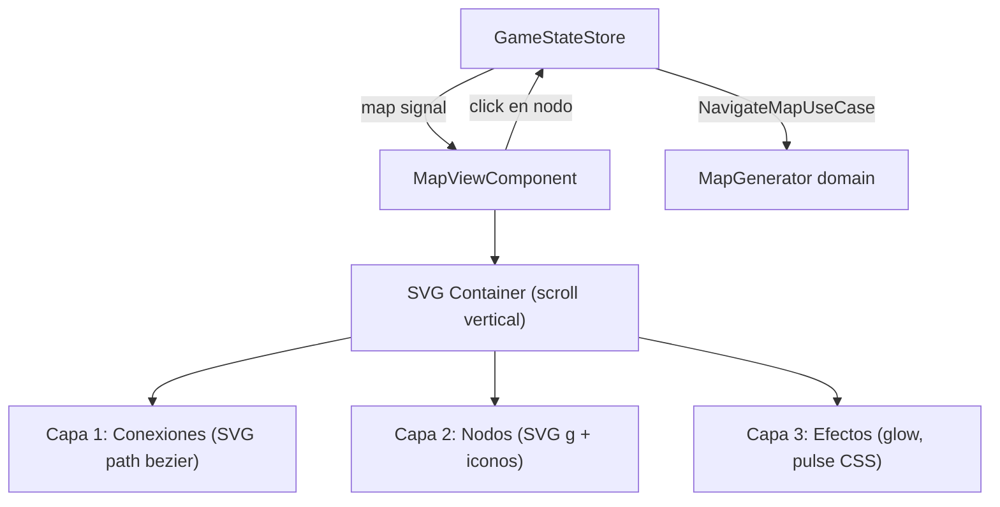
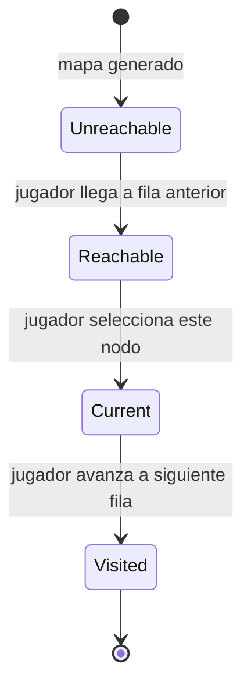
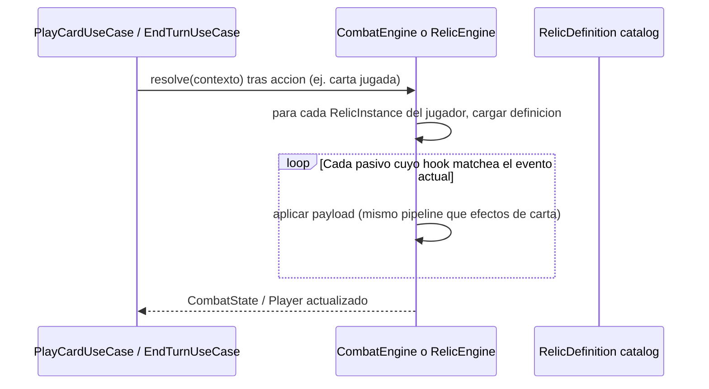

# Juego Roguelike Deck-Builder con Arquitectura Hexagonal en Angular 19

## Arquitectura Hexagonal

```mermaid
graph LR
    subgraph driving [Adaptadores Driving - UI]
        MainMenu[MainMenuComponent]
        CombatView[CombatViewComponent]
        MapView[MapViewComponent]
        ShopView[ShopComponent]
        RestView[RestSiteComponent]
    end

    subgraph app [Capa Aplicacion]
        UC_NewGame[NewGameUseCase]
        UC_PlayCard[PlayCardUseCase]
        UC_EndTurn[EndTurnUseCase]
        UC_Navigate[NavigateMapUseCase]
        UC_Shop[ShopUseCase]
        UC_SaveLoad[SaveLoadUseCase]
    end

    subgraph domainLayer [Capa Dominio]
        CombatEngine
        DeckManager
        EnemyAI
        MapGenerator
        ShopManager
        RewardGenerator
        Models["Models (Card, Player, Enemy...)"]
    end

    subgraph ports [Puertos de Salida]
        PortRepo["GameRepository (port)"]
        PortRenderer["CombatRenderer (port)"]
    end

    subgraph driven [Adaptadores Driven - Infra]
        IndexedDB[IndexedDbGameRepository]
        Canvas[CanvasCombatRenderer]
    end

    driving --> app
    app --> domainLayer
    app --> ports
    ports -.->|implementa| driven
```




La regla de dependencia es estricta: **las capas internas nunca conocen a las externas**. El dominio es TypeScript puro sin imports de Angular.

## Estructura de carpetas

```
src/app/
  domain/
    models/              # Interfaces y tipos puros
      card.model.ts
      player.model.ts
      enemy.model.ts
      combat.model.ts
      map.model.ts
      game-state.model.ts
      status-effect.model.ts
      relic.model.ts
    services/            # Logica de negocio pura (clases TS, sin Angular)
      combat-engine.ts
      deck-manager.ts
      enemy-ai.ts
      map-generator.ts
      shop-manager.ts
      reward-generator.ts
      relic-engine.ts      # Opcional: evaluacion de hooks de reliquias (o metodos en CombatEngine)
    ports/
      inbound/           # Interfaces de casos de uso
        play-card.usecase.ts
        start-combat.usecase.ts
        end-turn.usecase.ts
        navigate-map.usecase.ts
        ...
      outbound/          # Interfaces para adaptadores de salida
        game-repository.port.ts
        combat-renderer.port.ts
    data/                # Datos estaticos del juego (pertenecen al dominio)
      cards.data.ts
      enemies.data.ts
      encounters.data.ts
      relics.data.ts

  application/
    use-cases/           # Implementaciones de puertos inbound (orquestan dominio)
      new-game.usecase.ts
      play-card.usecase.ts
      end-turn.usecase.ts
      navigate-map.usecase.ts
      shop.usecase.ts
      rest.usecase.ts
      collect-reward.usecase.ts
      activate-relic.usecase.ts
      save-game.usecase.ts
      load-game.usecase.ts

  infrastructure/
    persistence/         # Adaptador driven: IndexedDB
      indexed-db-game-repository.ts
    canvas/              # Adaptador driven: Canvas rendering
      canvas-combat-renderer.ts
      particles.ts
      sprite-helpers.ts

  ui/                    # Adaptadores driving: componentes Angular
    game-state.store.ts  # Angular service con signals que expone estado al UI
    di/
      providers.ts       # Configuracion DI: bind puertos a adaptadores
    components/
      main-menu/
      game-container/
      combat-view/
      card/
      hand/
      map-view/
      shop/
      rest-site/
      reward/
      deck-viewer/
      game-over/
      relic-bar/
    shared/
      health-bar/
      energy-display/
      tooltip/
```

## Flujo de dependencias (ejemplo: jugar una carta)




## Capa de dominio (TypeScript puro)

### Servicios de dominio

Todos son clases puras sin dependencias de framework. Reciben estado y retornan nuevo estado (funciones puras o casi puras):

- **CombatEngine**: resuelve efectos de cartas, calcula danio (vulnerable +50%, weak -25%, strength +N), gestiona bloqueo, status effects
- **DeckManager**: barajado (Fisher-Yates), robo, descarte, exhaust, reshuffle, add/remove/upgrade
- **EnemyAI**: sistema de patrones de comportamiento (ver seccion detallada abajo)
- **MapGenerator**: generacion procedural de mapa tipo Slay the Spire (ver seccion detallada abajo)
- **ShopManager**: generacion de ofertas, precios por raridad, compra, eliminacion
- **RewardGenerator**: pool de cartas por raridad, oro por tipo de enemigo

### Sistema de IA Enemiga (EnemyAI) - Diseno detallado

La "IA" enemiga no es inteligencia artificial clasica. Es un **sistema de patrones de comportamiento predefinidos** donde cada enemigo tiene reglas que determinan su proxima accion (intent). Usamos el **patron Strategy** para que cada tipo de comportamiento sea una estrategia intercambiable.

#### 4 tipos de estrategia




**1. CyclicStrategy** - Rotacion fija de intents. El enemigo ejecuta una secuencia predefinida que se repite en bucle.

```typescript
// Ejemplo: Cultist -> turno 1 buff, luego ataque infinito
interface CyclicPattern {
  type: 'cyclic';
  sequence: Intent[];   // [Incantation, DarkStrike]
  startIndex?: number;  // por defecto 0
}
```

Enemigos que la usan: Cultist (buff -> attack loop), Hexaghost (secuencia de 6 movimientos).

**2. WeightedRandomStrategy** - Seleccion aleatoria con pesos y restricciones. Cada intent tiene un peso (probabilidad relativa) y hay reglas que evitan repeticiones excesivas.

```typescript
interface WeightedRandomPattern {
  type: 'weighted-random';
  moves: WeightedMove[];        // [{intent, weight}]
  maxConsecutive: number;        // no repetir mas de N veces seguidas (tipicamente 2)
  seed?: number;                 // para reproducibilidad con la seed de la run
}

interface WeightedMove {
  intent: Intent;
  weight: number;                // peso relativo (no necesita sumar 100)
}
```

Enemigos que la usan: Jaw Worm (Chomp 45%, Thrash 30%, Bellow 25%, max 2 consecutivas), Louse (Bite 75%, Grow 25%, max 1 consecutiva para Grow).

**3. ConditionalStrategy** - Arbol de decisiones basado en el estado del combate. Evalua condiciones sobre HP del enemigo, HP del jugador, status effects activos, turno actual, etc.

```typescript
interface ConditionalPattern {
  type: 'conditional';
  rules: ConditionalRule[];      // evaluadas en orden, primera que matchea gana
  fallback: Intent;              // si ninguna regla matchea
}

interface ConditionalRule {
  condition: IntentCondition;
  intent: Intent;
}

type IntentCondition =
  | { type: 'hp-below'; percent: number }         // HP enemigo < X%
  | { type: 'hp-above'; percent: number }         // HP enemigo > X%
  | { type: 'turn-equals'; turn: number }         // turno exacto
  | { type: 'turn-greater'; turn: number }        // turno > N
  | { type: 'player-has-status'; status: StatusType }
  | { type: 'player-played-type'; cardType: CardType } // el jugador jugo una skill/ataque este turno
  | { type: 'and'; conditions: IntentCondition[] }
  | { type: 'or'; conditions: IntentCondition[] }
  | { type: 'not'; condition: IntentCondition };
```

Enemigos que la usan: Gremlin Nob (si el jugador jugo una Skill este turno -> gana fuerza extra; turno 1 siempre Bellow), Slime Grande (si HP < 50% -> Split).

**4. PhasedStrategy** - Envuelve otras estrategias y cambia entre ellas segun umbrales de HP o condiciones. Ideal para bosses con "modos".

```typescript
interface PhasedPattern {
  type: 'phased';
  phases: Phase[];
  initialPhase: number;           // indice de la fase inicial
}

interface Phase {
  name: string;                   // e.g. "attack-mode", "defense-mode"
  strategy: CyclicPattern | WeightedRandomPattern | ConditionalPattern;
  transitionTo?: PhaseTransition[];
}

interface PhaseTransition {
  targetPhase: number;            // indice de la fase destino
  condition: IntentCondition;     // cuando transicionar
  resetSequence?: boolean;        // reiniciar la secuencia de la nueva fase
}
```

Enemigos que la usan: The Guardian (Attack Mode: secuencia ciclica de ataques crecientes -> transicion a Defense Mode al alcanzar threshold -> bloqueo masivo + espinas -> vuelve a Attack Mode), Lagavulin (Phase 0: dormido 3 turnos o hasta recibir danio -> Phase 1: alterna ataque/debuff).

#### Modelo de datos del enemigo

```typescript
// domain/models/enemy.model.ts
interface EnemyDefinition {
  id: string;                       // 'jaw-worm', 'the-guardian'
  name: string;
  tier: 'normal' | 'elite' | 'boss';
  baseHp: HpRange;                  // {min: 40, max: 44} -> se randomiza al instanciar
  pattern: EnemyPattern;            // una de las 4 estrategias
  onDeath?: DeathEffect;            // efectos especiales al morir (e.g. split)
}

type EnemyPattern = CyclicPattern | WeightedRandomPattern | ConditionalPattern | PhasedPattern;

// Estado de un enemigo durante combate (instancia viva)
interface EnemyInstance {
  definitionId: string;
  hp: number;
  maxHp: number;
  block: number;
  statusEffects: StatusEffect[];
  currentIntent: Intent | null;     // el intent visible al jugador (lo que va a hacer)
  aiState: {                        // estado interno de la IA
    turnCount: number;
    sequenceIndex: number;          // para CyclicStrategy
    lastMoves: string[];            // historial para WeightedRandom (evitar repeticiones)
    currentPhase: number;           // para PhasedStrategy
  };
}
```

#### Intents (acciones enemigas)

```typescript
interface Intent {
  id: string;                        // 'chomp', 'dark-strike', 'bellow'
  display: IntentDisplay;            // lo que ve el jugador
  actions: IntentAction[];           // lo que realmente hace
}

interface IntentDisplay {
  type: 'attack' | 'defend' | 'buff' | 'debuff' | 'attack-debuff' | 'unknown';
  value?: number;                    // danio mostrado (para attacks)
  times?: number;                    // x2, x3 para multi-hit
}

type IntentAction =
  | { type: 'damage'; value: number; times?: number }
  | { type: 'block'; value: number }
  | { type: 'buff'; status: StatusType; stacks: number }
  | { type: 'debuff-player'; status: StatusType; stacks: number }
  | { type: 'heal'; value: number }
  | { type: 'summon'; enemyId: string; count: number }
  | { type: 'split' };              // morir y generar 2 enemigos menores
```

#### EnemyAI service

```typescript
// domain/services/enemy-ai.ts
class EnemyAI {
  /** Determina el intent para el proximo turno (se llama al inicio del combate y al final de cada turno enemigo) */
  getNextIntent(enemy: EnemyInstance, context: CombatContext): Intent { ... }

  /** Resuelve las acciones de un intent contra el jugador. Retorna nuevo estado sin mutar. */
  resolveIntent(enemy: EnemyInstance, intent: Intent, player: Player): {
    updatedPlayer: Player;
    updatedEnemy: EnemyInstance;
  } { ... }
}

interface CombatContext {
  turnNumber: number;
  player: Player;
  allEnemies: EnemyInstance[];
  cardsPlayedThisTurn: Card[];       // para ConditionalStrategy (e.g. Gremlin Nob)
  rng: SeededRandom;                 // generador aleatorio con seed para reproducibilidad
}
```

#### Flujo de un turno enemigo




#### Seed y reproducibilidad

El sistema usa un **generador de numeros aleatorios con seed** (`SeededRandom`) en vez de `Math.random()`. Esto asegura que:

- Las runs con la misma seed producen los mismos enemigos con los mismos patrones
- Los intents de `WeightedRandomStrategy` son deterministas dado el mismo estado
- Se puede compartir una seed para que otro jugador enfrente el mismo desafio

```typescript
// domain/services/seeded-random.ts
class SeededRandom {
  constructor(private seed: number) {}
  next(): number { ... }           // retorna [0, 1) determinista
  nextInt(min: number, max: number): number { ... }
  weightedChoice<T>(items: {item: T, weight: number}[]): T { ... }
}
```

#### Tabla de enemigos y sus estrategias

**Normales:**

- **Jaw Worm**: `WeightedRandom` - Chomp(11dmg, 45%), Thrash(7dmg+5block, 30%), Bellow(+3str+6block, 25%). Max 2 consecutivas.
- **Cultist**: `Cyclic` - [Incantation(+3str), DarkStrike(6dmg)] loop desde indice 1.
- **Red Louse**: `WeightedRandom` - Bite(5-7dmg, 75%), Grow(+3str, 25%). Grow max 1 consecutiva.
- **Acid Slime M**: `WeightedRandom` - Tackle(10dmg, 40%), Lick(+1weak, 30%), Corrosive Spit(7dmg+addStatus, 30%). Max 2 consecutivas.
- **Fungi Beast**: `Cyclic` - [Bite(6dmg), Grow(+3str)] loop.

**Elites:**

- **Gremlin Nob**: `Conditional` - Turno 1: Bellow(+2str+enrage). Si jugador jugo Skill este turno: +2str extra. Fallback: Skull Bash(6dmg) o Rush(14dmg, alterna).
- **Lagavulin**: `Phased` - Fase 0(dormido): Sleep 3 turnos, transicion a Fase 1 si recibe danio o turno > 3. Fase 1: `Cyclic` [Attack(18dmg), Debuff(-1str-1dex al jugador)] loop.
- **Sentries** (x3): `Cyclic` con offset - Sentry A/C: [Bolt(9dmg), Daze(+2daze)]. Sentry B: [Daze(+2daze), Bolt(9dmg)]. Desincronizados.

**Bosses:**

- **The Guardian**: `Phased` - Fase AttackMode: `Cyclic` [Bash(32dmg), Whirlwind(5dmgx4), Charge(9block)]. Transicion a DefenseMode al recibir 30+ dmg acumulado. Fase DefenseMode: `Cyclic` [ShieldBash(36block+ThornsRetorno), RollAttack(9dmg)]. Transicion a AttackMode tras 2 turnos.
- **Hexaghost**: `Phased` - Fase 0: Activate (turno 1 solo). Fase 1: `Cyclic` [Divider(6dmg x6), Inferno(2dmgx6+addBurns), Sear(6dmg+addBurn), Tackle(5dmgx2), Sear, Inflame(+2str+12block)] loop de 6.

### Generador de Mapa Procedural (MapGenerator) - Diseno detallado

El mapa es un **grafo aciclico dirigido (DAG)** donde el jugador avanza de abajo (fila 0) hacia arriba (fila 14, el boss). El algoritmo genera el mapa trazando multiples caminos paralelos y fusionando nodos donde los caminos coinciden, produciendo una estructura de ramificacion natural.

#### Constantes del mapa

```typescript
const MAP_CONFIG = {
  TOTAL_ROWS: 15,          // filas 0-14
  MAX_COLUMNS: 7,          // columnas 0-6 (posiciones horizontales posibles)
  NUM_PATHS: 6,            // caminos trazados de abajo a arriba
  BOSS_ROW: 14,            // fila del boss (siempre la ultima)
  REST_ROW: 8,             // fila garantizada de descanso
} as const;
```

#### Algoritmo de generacion - 4 fases




**Fase 1: Trazar caminos (generatePaths)**

Se trazan `NUM_PATHS` (6) caminos independientes desde la fila 0 hasta la fila 14. Cada camino es una secuencia de posiciones (fila, columna).

```typescript
// Pseudocodigo
function generatePaths(rng: SeededRandom): PathTrace[] {
  const paths: PathTrace[] = [];

  for (let p = 0; p < NUM_PATHS; p++) {
    const path: Position[] = [];
    // Posicion inicial: columna aleatoria en fila 0
    let col = rng.nextInt(0, MAX_COLUMNS - 1);
    path.push({ row: 0, col });

    for (let row = 1; row < TOTAL_ROWS; row++) {
      // Drift: -1 (izquierda), 0 (centro), +1 (derecha)
      const drift = rng.nextInt(-1, 1);
      col = clamp(col + drift, 0, MAX_COLUMNS - 1);
      path.push({ row, col });
    }
    paths.push(path);
  }
  return paths;
}
```

**Fase 1.5: Restriccion de no-cruce (constrainPaths)**

Los caminos se ordenan por su columna inicial. Despues, en cada fila se aplica la restriccion: el camino `i` nunca puede estar a la derecha del camino `i+1` y viceversa. Si se detecta un cruce, se fuerza al camino a mantenerse en su columna anterior.

```typescript
function constrainPaths(paths: PathTrace[]): PathTrace[] {
  // Ordenar caminos por columna inicial (izquierda a derecha)
  paths.sort((a, b) => a[0].col - b[0].col);

  for (let row = 1; row < TOTAL_ROWS; row++) {
    for (let p = 0; p < paths.length - 1; p++) {
      // Si camino p esta a la derecha de camino p+1, intercambiar
      if (paths[p][row].col > paths[p + 1][row].col) {
        // Forzar: camino p no puede pasar al camino p+1
        paths[p][row].col = paths[p][row - 1].col;
      }
    }
  }
  return paths;
}
```

Esto garantiza que las lineas de conexion entre filas adyacentes nunca se cruzan visualmente.

**Fase 2: Merge de nodos y creacion de aristas (mergeNodes)**

Donde varios caminos pasan por la misma (fila, col), se crea un unico nodo. Las conexiones se extraen de los segmentos consecutivos de cada camino.

```typescript
function mergeNodes(paths: PathTrace[]): { nodes: MapNode[], edges: Edge[] } {
  const nodeMap = new Map<string, MapNode>();  // key: "row-col"
  const edgeSet = new Set<string>();           // key: "fromId->toId"

  for (const path of paths) {
    for (let i = 0; i < path.length; i++) {
      const { row, col } = path[i];
      const key = `${row}-${col}`;

      if (!nodeMap.has(key)) {
        nodeMap.set(key, {
          id: key,
          row, col,
          type: 'unknown',  // se asigna en Fase 3
          connections: [],
          visited: false,
        });
      }

      // Crear arista con el nodo de la fila anterior
      if (i > 0) {
        const prevKey = `${path[i-1].row}-${path[i-1].col}`;
        const edgeKey = `${prevKey}->${key}`;
        if (!edgeSet.has(edgeKey)) {
          edgeSet.add(edgeKey);
          nodeMap.get(prevKey)!.connections.push(key);
        }
      }
    }
  }

  return { nodes: [...nodeMap.values()], edges: [...edgeSet] };
}
```

Resultado tipico: ~35-55 nodos con ~50-70 aristas, dependiendo de cuanto convergen los caminos.

**Fase 3: Asignar tipos de nodo (assignNodeTypes)**

Cada nodo recibe un tipo segun reglas de distribucion y restricciones:

```typescript
interface TypeAssignmentRules {
  // Filas fijas (siempre el mismo tipo)
  fixedRows: {
    0: 'combat',            // primera fila siempre combate normal
    8: 'rest',              // fila 8 siempre descanso
    14: 'boss',             // ultima fila siempre boss
  };

  // Restricciones de vecindad
  constraints: [
    'no elite en filas 0-4',              // demasiado temprano
    'no elite en fila 13',                // justo antes del boss
    'no 2 descansos consecutivos en un mismo camino',
    'no tienda en fila 0',
    'no elite adyacente a otro elite en el mismo camino',
  ];

  // Distribucion objetivo (para filas no fijas)
  distribution: {
    combat:  0.45,     // ~45% - combate normal
    event:   0.22,     // ~22% - eventos aleatorios
    elite:   0.08,     // ~8%  - combates elite (dificiles, mejor recompensa)
    rest:    0.12,     // ~12% - hogueras
    shop:    0.05,     // ~5%  - tiendas
    treasure:0.08,     // ~8%  - cofres del tesoro
  };
}
```

Algoritmo de asignacion:

1. Primero asignar filas fijas (0, 8, 14)
2. Para el resto de nodos, crear un pool con la distribucion objetivo
3. Barajar el pool con `SeededRandom`
4. Asignar tipos del pool respetando restricciones
5. Si una restriccion se viola, reasignar con el tipo mas comun (combat) y reintentar

**Fase 4: Validacion (validateMap)**

Verificaciones finales:

- Todo nodo en fila 0 puede alcanzar fila 14 (garantizado por construccion)
- No hay nodos huerfanos (sin conexion entrante excepto fila 0)
- Hay al menos 1 nodo por fila
- Hay al menos 1 elite y 1 descanso en el mapa

#### Modelos de datos del mapa

```typescript
// domain/models/map.model.ts
interface MapNode {
  id: string;                   // "row-col", e.g. "3-2"
  row: number;                  // 0-14
  col: number;                  // 0-6
  type: NodeType;
  connections: string[];        // IDs de nodos en la fila row+1 a los que conecta
  visited: boolean;
}

type NodeType = 'combat' | 'elite' | 'rest' | 'shop' | 'treasure' | 'event' | 'boss';

interface GameMap {
  nodes: Map<string, MapNode>;  // nodeId -> MapNode
  currentNodeId: string | null; // null = aun no empezo (elige en fila 0)
  act: number;                  // 1, 2, 3
  bossId: string;               // ID del enemigo boss de este acto
}
```

#### Ejemplo visual de mapa generado

```
Fila 14 (BOSS):          [B]
                         / | \
Fila 13:            [C] [C] [E]
                    / \   |   |
Fila 12:         [S]  [?] [C]
                  |   / \   |
Fila 11:         [C] [C] [?]
                  |   |   / \
Fila 10:         [?] [E] [C]
                  \ / |   |
Fila 9:           [C] [S] [C]
                  / |   \ /
Fila 8 (REST):  [R] [R]  [R]
                 |   |  /  \
Fila 7:         [?] [C] [C]
                  \ / |   |
Fila 6:          [C] [?] [E]
                  |  / \   |
Fila 5:         [C] [C] [C]
                 | X |   |
Fila 4:         [?] [C] [C]
                  |   |  / \
Fila 3:         [C] [S] [?]
                 |   |   |
Fila 2:         [?] [C] [C]
                  \ / \   |
Fila 1:          [C] [?] [C]
                 / |   \ /
Fila 0 (START): [C] [C] [C]

Leyenda: [C]=Combat [E]=Elite [R]=Rest [S]=Shop [?]=Event [B]=Boss
```

#### API del MapGenerator

```typescript
// domain/services/map-generator.ts
class MapGenerator {
  /** Genera un mapa completo para un acto */
  generateMap(act: number, rng: SeededRandom): GameMap { ... }

  /** Retorna IDs de nodos a los que el jugador puede moverse desde su posicion actual */
  getReachableNodes(map: GameMap): string[] {
    if (map.currentNodeId === null) {
      // Primera eleccion: todos los nodos de fila 0
      return [...map.nodes.values()]
        .filter(n => n.row === 0)
        .map(n => n.id);
    }
    // Nodos conectados desde el nodo actual
    return map.nodes.get(map.currentNodeId)!.connections;
  }

  /** Mueve al jugador a un nodo. Retorna nuevo GameMap con nodo marcado visitado */
  moveToNode(map: GameMap, nodeId: string): GameMap {
    const node = map.nodes.get(nodeId)!;
    const updatedNodes = new Map(map.nodes);
    updatedNodes.set(nodeId, { ...node, visited: true });
    return { ...map, nodes: updatedNodes, currentNodeId: nodeId };
  }
}
```

### Renderizado SVG del Mapa (MapViewComponent) - Diseno detallado

El mapa se renderiza como SVG inline dentro de un componente Angular. No es un puerto de salida (no necesita adaptador) porque el SVG es parte directa de la capa UI.

#### Arquitectura del componente




#### Sistema de coordenadas

```typescript
// Coordenadas de layout del mapa
interface MapLayout {
  width: number;              // ancho total del SVG (e.g. 600px)
  height: number;             // alto total (TOTAL_ROWS * ROW_HEIGHT)
  rowHeight: number;          // espacio vertical entre filas (e.g. 80px)
  colWidth: number;           // espacio horizontal entre columnas (e.g. 80px)
  paddingX: number;           // margen horizontal
  paddingY: number;           // margen vertical
  jitterMax: number;          // desplazamiento aleatorio para aspecto organico (e.g. 8px)
}

function nodePosition(node: MapNode, layout: MapLayout, rng: SeededRandom): {x: number, y: number} {
  // Fila 0 esta abajo, fila 14 arriba (invertir eje Y)
  const baseX = layout.paddingX + node.col * layout.colWidth;
  const baseY = layout.height - layout.paddingY - node.row * layout.rowHeight;

  // Jitter deterministico (misma posicion siempre para misma seed)
  const jitterX = rng.nextFloat(-layout.jitterMax, layout.jitterMax);
  const jitterY = rng.nextFloat(-layout.jitterMax, layout.jitterMax);

  return { x: baseX + jitterX, y: baseY + jitterY };
}
```

El jitter (desplazamiento aleatorio pequeno) evita que los nodos queden en una rejilla perfecta y da al mapa un aspecto organico como en Slay the Spire.

#### Renderizado de conexiones (SVG Path Bezier)

Las conexiones entre nodos se dibujan como curvas bezier cubicas para que tengan un aspecto suave y natural.

```typescript
// Genera un SVG path de curva bezier entre dos nodos
function connectionPath(from: {x: number, y: number}, to: {x: number, y: number}): string {
  const midY = (from.y + to.y) / 2;
  // Puntos de control: misma X que los extremos, Y en el punto medio
  // Esto crea una curva en S suave
  return `M ${from.x} ${from.y} C ${from.x} ${midY}, ${to.x} ${midY}, ${to.x} ${to.y}`;
}
```

```svg
<!-- Ejemplo de conexion renderizada -->
<path d="M 120 960 C 120 920, 200 920, 200 880"
      class="map-path"
      [class.visited]="edge.visited"
      [class.reachable]="edge.reachable"
      [class.future]="edge.future" />
```

**3 estados visuales de conexiones:**


| Estado      | Condicion                                | Estilo                                             |
| ----------- | ---------------------------------------- | -------------------------------------------------- |
| `visited`   | Ambos nodos visitados                    | Linea solida, color dorado (#d4a574), opacidad 1.0 |
| `reachable` | Conecta nodo actual con nodo alcanzable  | Linea punteada animada, color claro, opacidad 0.7  |
| `future`    | Ningun nodo conectado es actual/visitado | Linea muy tenue, color gris, opacidad 0.15         |


#### Renderizado de nodos (SVG icons)

Cada tipo de nodo tiene un icono SVG distinto, renderizado como `<g>` (grupo) con transformaciones.

```typescript
// Iconos por tipo de nodo (SVG paths simplificados)
const NODE_ICONS: Record<NodeType, NodeVisual> = {
  combat:   { symbol: '⚔', color: '#c84b31', size: 20, shape: 'circle' },
  elite:    { symbol: '💀', color: '#ff6b35', size: 24, shape: 'diamond' },
  rest:     { symbol: '🔥', color: '#2eb872', size: 22, shape: 'circle' },
  shop:     { symbol: '$',  color: '#f0c040', size: 20, shape: 'circle' },
  treasure: { symbol: '■',  color: '#f0c040', size: 18, shape: 'square' },
  event:    { symbol: '?',  color: '#6b7fd7', size: 22, shape: 'circle' },
  boss:     { symbol: '👑', color: '#e94560', size: 30, shape: 'hexagon' },
};
```

En la practica, en lugar de emojis se usaran SVG paths vectoriales para cada icono (mas control, mejor rendimiento, escalable).

#### 4 estados visuales de nodos




| Estado          | Condicion                           | Estilo visual                                                                  |
| --------------- | ----------------------------------- | ------------------------------------------------------------------------------ |
| **Unreachable** | No conectado al nodo actual         | Gris oscuro, opacidad 0.3, sin interaccion                                     |
| **Reachable**   | En `getReachableNodes()` del actual | Brillo completo, borde luminoso (glow), animacion de pulso CSS, cursor pointer |
| **Current**     | Es `currentNodeId`                  | Anillo dorado exterior, tamano ligeramente mayor                               |
| **Visited**     | `node.visited === true`             | Color normal, pequena marca de check, sin interaccion                          |


#### SCSS del mapa

```scss
// Estilos core del mapa
.map-container {
  width: 100%;
  height: 100vh;
  overflow-y: auto;
  overflow-x: hidden;
  background: linear-gradient(to top, #0a0a1a, #1a1a2e, #0f0f23);
}

.map-node {
  cursor: default;
  transition: transform 0.2s ease, filter 0.3s ease;

  &--unreachable {
    opacity: 0.25;
    filter: grayscale(0.8);
  }

  &--reachable {
    cursor: pointer;
    filter: drop-shadow(0 0 8px currentColor);
    animation: pulse 1.5s ease-in-out infinite;
  }

  &--current {
    filter: drop-shadow(0 0 12px #d4a574);
    transform: scale(1.15);
  }

  &--visited {
    opacity: 0.7;
  }
}

.map-path {
  fill: none;
  stroke-width: 2;
  stroke-linecap: round;

  &.visited { stroke: #d4a574; opacity: 1.0; }
  &.reachable { stroke: #8899aa; opacity: 0.6; stroke-dasharray: 6 4; }
  &.future { stroke: #334455; opacity: 0.15; }
}

@keyframes pulse {
  0%, 100% { transform: scale(1); }
  50% { transform: scale(1.08); }
}
```

#### Template Angular del componente (simplificado)

```html
<!-- map-view.component.html -->
<div class="map-container" #scrollContainer>
  <svg [attr.width]="layout.width" [attr.height]="layout.height"
       [attr.viewBox]="'0 0 ' + layout.width + ' ' + layout.height">

    <!-- Capa 1: Conexiones -->
    <g class="map-paths">
      @for (edge of edges(); track edge.id) {
        <path [attr.d]="edge.path"
              class="map-path"
              [class.visited]="edge.visited"
              [class.reachable]="edge.reachable"
              [class.future]="edge.future" />
      }
    </g>

    <!-- Capa 2: Nodos -->
    <g class="map-nodes">
      @for (node of nodes(); track node.id) {
        <g class="map-node"
           [class.map-node--unreachable]="node.state === 'unreachable'"
           [class.map-node--reachable]="node.state === 'reachable'"
           [class.map-node--current]="node.state === 'current'"
           [class.map-node--visited]="node.state === 'visited'"
           [attr.transform]="'translate(' + node.x + ',' + node.y + ')'"
           (click)="onNodeClick(node)">

          <!-- Forma base del nodo -->
          <circle r="18" class="node-bg" />

          <!-- Icono SVG del tipo -->
          <use [attr.href]="'#icon-' + node.type" />

          <!-- Marca de visitado -->
          @if (node.state === 'visited') {
            <circle r="4" cx="12" cy="-12" class="visited-dot" />
          }
        </g>
      }
    </g>

    <!-- Definiciones de iconos SVG reutilizables -->
    <defs>
      <symbol id="icon-combat"><!-- SVG path espadas cruzadas --></symbol>
      <symbol id="icon-elite"><!-- SVG path calavera --></symbol>
      <symbol id="icon-rest"><!-- SVG path hoguera --></symbol>
      <symbol id="icon-shop"><!-- SVG path bolsa/moneda --></symbol>
      <symbol id="icon-event"><!-- SVG path signo interrogacion --></symbol>
      <symbol id="icon-boss"><!-- SVG path corona --></symbol>
      <symbol id="icon-treasure"><!-- SVG path cofre --></symbol>
    </defs>
  </svg>
</div>
```

#### Computed signals del componente

```typescript
@Component({ ... })
export class MapViewComponent {
  private store = inject(GameStateStore);
  private mapGenerator = inject(MapGenerator);

  private gameMap = this.store.map;
  private reachable = computed(() => {
    const map = this.gameMap();
    return map ? this.mapGenerator.getReachableNodes(map) : [];
  });

  // Nodos transformados a coordenadas SVG con estado visual
  nodes = computed(() => {
    const map = this.gameMap();
    if (!map) return [];
    const reachableIds = new Set(this.reachable());

    return [...map.nodes.values()].map(node => ({
      ...node,
      ...nodePosition(node, this.layout, this.rng),
      state: this.getNodeState(node, map.currentNodeId, reachableIds),
    }));
  });

  // Aristas transformadas a SVG paths con estado visual
  edges = computed(() => { ... });

  onNodeClick(node: MapNodeView) {
    if (node.state === 'reachable') {
      this.store.navigateToNode(node.id);
    }
  }
}
```

#### Auto-scroll

Cuando el jugador avanza en el mapa, el contenedor hace scroll automatico para centrar la fila actual:

```typescript
private scrollToCurrentNode() {
  const map = this.gameMap();
  if (!map?.currentNodeId) return;

  const node = map.nodes.get(map.currentNodeId)!;
  const y = this.layout.height - this.layout.paddingY - node.row * this.layout.rowHeight;

  this.scrollContainer.nativeElement.scrollTo({
    top: y - window.innerHeight / 2,
    behavior: 'smooth',
  });
}
```

### Sistema de Reliquias (Relics) — efectos pasivos y activos unicos

Las reliquias amplian el deck-builder con **modificadores persistentes en la run**. A diferencia de las cartas (jugadas y descartadas), las reliquias viven en `Player` como una lista ordenada y disparan logica en **momentos concretos del combate o del mapa** (pasivos) o bajo **accion explicita del jugador** (activos). El diseno debe mantener el dominio puro: definiciones en datos estaticos, comportamiento como **hooks** tipados y un unico lugar que los evalua (CombatEngine extendido o `RelicEngine` en `domain/services/`).

#### Conceptos


| Concepto       | Descripcion                                                                                                                                                        |
| -------------- | ------------------------------------------------------------------------------------------------------------------------------------------------------------------ |
| **Definicion** | Datos inmutables en `relics.data.ts`: id, nombre, rareza, texto de reglas, lista de pasivos, bloque opcional de activo.                                            |
| **Instancia**  | Estado por run/combate: referencia a `definitionId`, contadores de cooldown, cargas restantes, flags (`usedThisCombat`).                                           |
| **Pasivo**     | Efecto que se resuelve automaticamente cuando ocurre un **hook** (evento de dominio). Puede ser unico por reliquia combinando varios hooks en la misma definicion. |
| **Activo**     | Efecto que solo se aplica cuando el jugador pulsa la reliquia (o atajo). Suele limitarse a **N usos por combate** o **cooldown en turnos**.                        |


#### Modelo de datos (dominio)

Separar **catalogo** (global, `as const`) de **estado en partida**:

```typescript
// domain/models/relic.model.ts — esquema orientativo

type RelicRarity = 'starter' | 'common' | 'uncommon' | 'rare' | 'boss' | 'shop';

/** Eventos del dominio donde un pasivo puede reaccionar (extensible) */
type RelicPassiveHook =
  | { type: 'combat-start' }
  | { type: 'turn-start'; owner: 'player' | 'enemy' }
  | { type: 'turn-end'; owner: 'player' | 'enemy' }
  | { type: 'card-played'; cardTypeFilter?: CardType }
  | { type: 'damage-dealt'; source: 'player-card' | 'player-powers' | 'any' }
  | { type: 'card-drawn' }
  | { type: 'gold-gained' }                    // fuera de combate / recompensas
  | { type: 'enter-node'; nodeType?: NodeType }
  | { type: 'hp-lost' };                       // opcional: umbral o cada tick

/** Efecto resuelto por el motor (misma filosofia que efectos de carta) */
type RelicPassiveEffect = {
  id: string;
  hook: RelicPassiveHook;
  /** Parametros concretos: draw 1, +1 str este combate, curar 3, duplicar primer ataque, etc. */
  payload: RelicEffectPayload;
};

type RelicActiveConfig = {
  /** Maximo de activaciones por combate (undefined = ilimitado con otras reglas) */
  usesPerCombat?: number;
  /** Enfriamiento en turnos del jugador entre usos */
  cooldownTurns?: number;
  /** Coste de energia adicional al pulsar (opcional) */
  energyCost?: number;
  payload: RelicEffectPayload;
};

interface RelicDefinition {
  id: string;
  name: string;
  description: string;
  rarity: RelicRarity;
  passiveEffects: RelicPassiveEffect[];
  /** Si es null, la reliquia es solo pasiva (como muchas en STS) */
  active: RelicActiveConfig | null;
}

interface RelicInstance {
  definitionId: string;
  /** Turnos hasta poder usar activo de nuevo */
  cooldownRemaining: number;
  /** Para limites por combate */
  activationsThisCombat: number;
}
```

`RelicEffectPayload` debe ser una **union discriminada** reutilizable con los efectos ya existentes del `CombatEngine` (danio, bloqueo, robar, aplicar status, modificar energia, etc.) para no duplicar logica. Si un efecto es verdaderamente unico, se anade un caso nuevo y una rama en el motor.

#### Flujo de evaluacion de pasivos




**Reglas de diseno:**

1. **Orden**: Fijar orden estable (orden de obtencion de reliquias o orden en el array) para que dos reliquias que roban cartas no produzcan resultados ambiguos; documentar en comentario si alguna combiacion es especial.
2. **Un solo barrido por evento**: Tras cada accion atomica (una carta jugada, un fin de turno), evaluar todos los hooks de ese evento una vez, evitando recursividad infinita salvo casos controlados (si A roba y B reacciona a robar, definir si B ve la carta robada por A en el mismo paso).
3. **Determinismo**: Usar `SeededRandom` del contexto de combate para cualquier parte aleatoria de un pasivo.

#### Activos: validacion y caso de uso

El activo **no** debe colarse desde la UI directamente al `CombatEngine`. Patron recomendado:

- **Puerto inbound** `ActivateRelicUseCase` con `execute(relicInstanceId, gameState)`.
- Validaciones en aplicacion + dominio: fase es combate, no hay cooldown, no se supero `usesPerCombat`, si hay `energyCost` el jugador tiene energia (o se descuenta antes de aplicar el payload).
- Tras aplicar, incrementar `activationsThisCombat`, poner `cooldownRemaining` si aplica, y opcionalmente `CombatRendererPort.animateRelicActivate(relicId)`.

```typescript
// Pseudofirma
interface ActivateRelicUseCase {
  execute(relicDefinitionId: string, state: GameState): Promise<GameState>;
}
```

#### Integracion con GameState y persistencia

- `Player` incluye `relics: RelicInstance[]` (o solo IDs si el estado vive siempre en instancias minimas).
- Al **guardar partida**, serializar instancias con cooldowns y contadores de combate; al **cargar**, resetear flags que deban ser solo del combate actual (`activationsThisCombat` al entrar en combate).
- Obtener reliquias: cofres, tiendas, recompensas de elite/boss, eventos — reutilizar `RewardGenerator` o un `RelicRewardGenerator` en dominio con pools por rareza y acto.

#### UI (capa Angular)

- **RelicBarComponent**: fila de iconos con tooltip (nombre + descripcion + estado del activo: listo / N turnos / agotado este combate).
- Accesibilidad: boton o tecla numerada por slot; `OnPush` + signals derivados del store.
- No mezclar logica de reglas en el componente: solo disparar `ActivateRelicUseCase` y reflejar estado.

#### Tests (regla del proyecto)

- **Dominio**: un `.spec.ts` por clase publica (`relic-engine.spec.ts` o tests en `combat-engine.spec.ts` para hooks), happy path + caso limite (cooldown agotado, activo sin energia).
- **Use case**: mock de `CombatRendererPort`; sin `TestBed`.

#### Como anadir una reliquia nueva (checklist)

1. Anadir entrada en `domain/data/relics.data.ts` con `id` unico kebab-case.
2. Definir `passiveEffects` con hooks y `payload` ya soportados; si hace falta un efecto nuevo, extender `RelicEffectPayload` y la rama correspondiente en el motor.
3. Si tiene activo, rellenar `active` con limites y payload; implementar animacion opcional en el renderer.
4. Incluir la reliquia en el pool de recompensas adecuado (elite, boss, tienda).
5. Tests de dominio y, si aplica, del use case de activacion.

#### Fase de implementacion sugerida

Encajar despues de **CombatEngine** estable y **Player** con inventario ampliable: modelos + motor de hooks + datos de ejemplo (2–3 reliquias: una solo pasiva, una pasiva+activa, una con hook raro) + barra UI + persistencia.

### Puertos de salida (interfaces)

```typescript
// domain/ports/outbound/game-repository.port.ts
export interface GameRepository {
  save(state: GameState): Promise<void>;
  load(): Promise<GameState | null>;
  deleteSave(): Promise<void>;
  getStats(): Promise<GameStats>;
  updateStats(stats: Partial<GameStats>): Promise<void>;
}

// domain/ports/outbound/combat-renderer.port.ts
export interface CombatRendererPort {
  renderScene(combat: CombatState): void;
  animateDamage(targetIdx: number, amount: number): Promise<void>;
  animateBlock(targetIdx: number, amount: number): Promise<void>;
  animateDeath(targetIdx: number): Promise<void>;
  animateCardPlay(card: Card): Promise<void>;
  /** Opcional cuando exista sistema de reliquias con activo */
  animateRelicActivate?(relicId: string): Promise<void>;
}
```

## Capa de aplicacion (use cases)

Los use cases son el pegamento entre dominio e infraestructura. Reciben puertos de salida via constructor (DI):

```typescript
// application/use-cases/play-card.usecase.ts
export class PlayCardUseCaseImpl implements PlayCardUseCase {
  constructor(
    private combatEngine: CombatEngine,
    private deckManager: DeckManager,
    private renderer: CombatRendererPort
  ) {}

  async execute(card: Card, targetIdx: number, state: GameState): Promise<GameState> {
    const combat = state.combat!;
    const newCombat = this.combatEngine.resolveCardEffects(card, targetIdx, combat);
    await this.renderer.animateCardPlay(card);
    if (newCombat.damageDealt > 0) {
      await this.renderer.animateDamage(targetIdx, newCombat.damageDealt);
    }
    return { ...state, combat: newCombat };
  }
}
```

## Capa de infraestructura (adaptadores driven)

- **IndexedDbGameRepository**: implementa `GameRepository` usando `idb`. Stores: saves, stats.
- **CanvasCombatRenderer**: implementa `CombatRendererPort`. Canvas 2D con render loop, particulas, sprites geometricos.

## Capa UI (adaptadores driving)

### GameStateStore (servicio Angular)

Unico servicio Angular que actua como fachada entre UI y use cases:

```typescript
@Injectable({ providedIn: 'root' })
export class GameStateStore {
  private state = signal<GameState>(initialState);

  phase = computed(() => this.state().phase);
  player = computed(() => this.state().player);
  combat = computed(() => this.state().combat);
  map = computed(() => this.state().map);

  private playCardUC = inject(PLAY_CARD_USE_CASE);

  async playCard(card: Card, targetIdx: number) {
    const newState = await this.playCardUC.execute(card, targetIdx, this.state());
    this.state.set(newState);
  }
}
```

### DI (Dependency Injection)

En `ui/di/providers.ts` se configura el binding de puertos a implementaciones:

```typescript
export const GAME_PROVIDERS = [
  { provide: GAME_REPOSITORY, useClass: IndexedDbGameRepository },
  { provide: COMBAT_RENDERER, useClass: CanvasCombatRenderer },
  { provide: PLAY_CARD_USE_CASE, useFactory: () => new PlayCardUseCaseImpl(...) },
  // ...
];
```

## Contenido del juego (datos en dominio)

En `domain/data/`:

- **cards.data.ts**: ~30-40 cartas (ataques, habilidades, poderes)
- **enemies.data.ts**: ~10-12 enemigos (normales, elites, bosses)
- **encounters.data.ts**: pools de encuentros por tipo de nodo y acto
- **relics.data.ts**: catalogo de reliquias con metadatos, efectos pasivos (hooks) y configuracion de activo opcional

## Reglas de Cursor (6 steering files)

- **project-hexagonal.mdc** (alwaysApply): Capas, regla de dependencia, donde va cada cosa, terminologia
- **domain-layer.mdc** (domain/**): TS puro, sin imports Angular, inmutabilidad, funciones puras
- **angular-components.mdc** (ui/**/*.component.ts): Standalone, inject(), signals, OnPush, delegan a use cases
- **infrastructure-adapters.mdc** (infrastructure/**): Implementan puertos, no conocen dominio interno
- **game-data.mdc** (domain/data/**): as const, IDs unicos kebab-case, arrays de Effect tipados
- **scss-styles.mdc** (**/*.scss): Paleta dungeon, variables, BEM, bordes por raridad

## Orden de implementacion (14 fases, 75 tickets)

- **Fase 0** (6): Reglas de Cursor
- **Fase 1** (3): Setup proyecto + deps + estructura hexagonal
- **Fase 2** (7): Modelos de dominio
- **Fase 3** (3): Puertos (inbound + outbound)
- **Fase 4** (14): Servicios de dominio (CombatEngine, DeckManager, EnemyAI x3, SeededRandom, MapGenerator x4, ShopManager, RewardGenerator)
- **Fase 5** (7): Datos estaticos (cartas, enemigos, encuentros)
- **Fase 6** (8): Casos de uso (capa aplicacion)
- **Fase 7** (2): Adaptador persistencia (IndexedDB)
- **Fase 8** (2): Adaptador estado Angular (GameStateStore + DI)
- **Fase 9** (3): Adaptador Canvas (renderer)
- **Fase 10** (3): UI combate (card, hand, combat view)
- **Fase 11** (5): UI mapa (layout SVG, nodos con iconos, conexiones bezier, estados visuales, interaccion)
- **Fase 12** (3): UI tienda, descanso, recompensa
- **Fase 13** (6): Flujo del juego (menu, container, game over, transiciones, autosave)
- **Fase 14** (3): Pulido visual
- **Fase 15** (opcional, post-MVP): Reliquias — modelos, `relics.data.ts`, hooks en motor, `ActivateRelicUseCase`, `RelicBarComponent`, persistencia

**Hito jugable minimo**: Fases 0-11 (~57 tickets) permiten combatir y navegar el mapa.
**Ventaja hexagonal**: el dominio (Fases 2-5) se puede testear unitariamente sin Angular ni Canvas.
**Ventaja Strategy pattern en IA**: cada nuevo enemigo solo requiere definir su `EnemyPattern` en los datos estaticos, sin tocar codigo de logica.
**Ventaja path-first map generation**: el algoritmo de caminos garantiza que no hay cruces y que todo nodo de fila 0 conecta con el boss. Usar SeededRandom hace que la misma seed produzca siempre el mismo mapa.